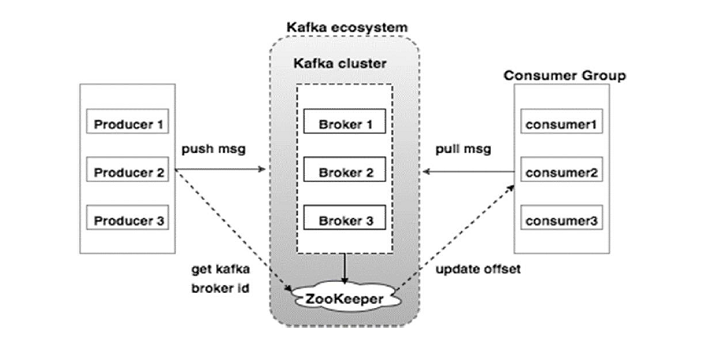

# Kafka
### What is Apache Kafka?
* Apache Kafka is a distributed event streaming platform used for real-time data processing. 
* It is designed to handle large amounts of data by efficiently processing and transmitting messages across different systems.

Kafka follows a publish-subscribe model, where producers send messages to topics, and consumers read messages from those topics.

### Kafka Architecture

### Producer
* A producer is responsible for sending messages to Kafka topics. 
* Producers push data to Kafka, and Kafka ensures the messages are stored and delivered reliably.

#### Consumer
* A consumer reads messages from Kafka topics. 
* Consumers subscribe to topics and process incoming messages

#### Topic
* A topic is like a channel where messages are published. 
* Each topic can have multiple partitions that allow parallel processing.

#### Partition
* A partition is a subdivision of a topic. 
* Each message in a topic is assigned to a partition based on a key.

**Parallel Processing**: Partitions allow multiple consumers to process data simultaneously.

**Message Ordering**: Messages in a partition are stored in the order they arrive.

#### Offset
* Each message in a partition has a unique offset (a sequential ID).
* Consumers use offsets to keep track of their read position.

#### Broker
* A broker is a Kafka server that stores and manages messages. 
* A Kafka cluster typically has multiple brokers.

- Each broker is identified by a broker ID.
- Producers and consumers communicate with brokers.
- Messages are distributed across brokers.

#### Zookeeper
Zookeeper is used for:

- Managing metadata (topics, brokers, partitions).
- Leader election for partitions.
- Keeping track of consumer group offsets.

#### Consumer Group
* A consumer group is a group of consumers that share the same group ID and work together to process messages from a topic.

- Each message is processed by only one consumer in the group.
- Multiple consumer groups can subscribe to the same topic.

#### How Kafka Works
- Producers send messages to Kafka topics.
- Kafka stores messages in partitions across brokers.
- Consumers read messages from topics using a consumer group.
- Kafka retains messages for a configured time (e.g., 7 days).
- Consumers track their offsets and process messages accordingly.

